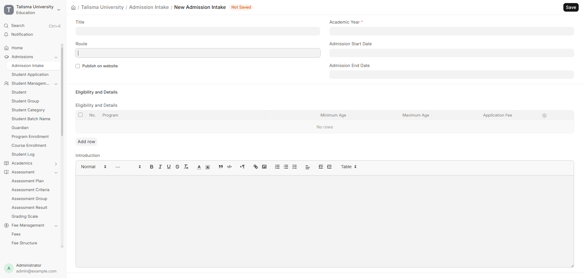

# Talisma SIS Client Demo Script

Use synthetic data only. The recommended walkthrough takes 10-12 minutes.

## Admissions operations

1. Open **Talisma Admissions**.
2. Select **Applicants** and explain the Applied, Approved, Rejected, and Admitted stages.
3. Open an approved applicant and point out Program, Academic Year, Academic Term, and Campus.
4. Under **Talisma Admissions**, select **Admit and Create Student**.
5. Add an optional internal decision note and confirm the admission.
6. Show the resulting Program Enrollment, including the student, program, term, and campus.
7. Return to the applicant and show Decision Date, Student Record, and Program Enrollment.
8. Explain that repeating the action returns the same records and cannot create duplicates.
9. Open **Programs** to show the owning School of Computing.

For the prepared demonstration, Avery Johnson is already admitted and linked
to Student `EDU-STU-2026-00008` and Program Enrollment `EDU-ENR-2026-00008`.
Use another approved applicant only after deliberately resetting its scenario.

## Registrar operations

1. Open **Talisma Registrar**.
2. Show the Students, Program Enrollments, Course Registrations, and Programs number cards.
3. Open **Program Enrollments** and select Avery Johnson (`EDU-ENR-2026-00008`).
4. Point out the Fall 2026 term, Main Campus, and registration summary.
5. Under **Talisma Registrar**, select **Register Courses**.
6. Select an available curriculum course and confirm registration.
7. Use **View Course Registrations** to show the filtered registration list.
8. Explain that only courses in the student's Program curriculum are available.
9. Explain that repeated registration is idempotent and the demo maximum is five courses per term.
10. Connect the Student, Program Enrollment, Course Enrollment, Campus, and Academic Unit records.

## US academic model

1. Open **Course** and show Subject Code, Catalog Number, Credit Hours, Course Level, and Grading Basis.
2. Open the Fall 2026 **Academic Term** and show registration, add/drop, census, withdrawal, and grades-due dates.
3. Open a course-based **Student Group** and explain that it is the Education-native course section.
4. Show CRN, section number, campus, delivery method, capacity, waitlist capacity, meeting pattern, room, and instructor.
5. Open the related **Course Schedule** to show the dated class meeting used by attendance and scheduling.
6. Return to Avery's Program Enrollment and register an open CRN through **Register Courses**.
7. Explain that regulatory processing remains outside the demo scope; see `US_MVP_SCOPE.md`.

## Position the MVP honestly

Demonstrate this as a coherent admissions-to-registration workflow and a
foundation for advising, attendance, assessment, and transcript capabilities.
Do not describe it as production-ready registration, official transcript,
financial-aid, or FERPA-compliance functionality.
