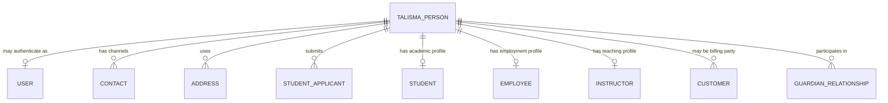

# ADR-002: Identity and Party Model

- **Status:** Proposed
- **Date:** 2026-07-11
- **Decision owners:** Product Architecture, Registrar Domain, Security and Engineering
- **Depends on:** ADR-001
- **Supersedes:** None

## Context

A higher-education institution interacts with one natural person through multiple simultaneous and changing relationships. A person may be an applicant, student, alumnus, employee, instructor, advisor, guardian, sponsor, customer contact, or system user.

Frappe and ERPNext intentionally represent these concerns through separate records:

- `User` represents authentication and system access.
- `Contact` and `Address` represent communication channels and addresses.
- `Customer` represents a billing party.
- `Employee` represents employment.
- Education `Instructor` represents teaching identity.
- Education `Student Applicant` represents an application participant.
- Education `Student` represents academic student identity.
- Education `Guardian` represents a guardian relationship.

No single upstream record safely represents the institution's canonical natural person across all relationships. Selecting Student, Employee, Customer, Contact, or User as the universal person record would overload its ownership and lifecycle.

## Decision drivers

- Prevent duplicate people across admissions, student records, employment, and billing.
- Preserve clear ownership of role-specific records.
- Support a person holding several roles concurrently.
- Separate authentication from institutional identity.
- Support legal/preferred names, identifiers, privacy, history, and identity evidence.
- Minimize unnecessary personal data replication.
- Enable controlled matching, merging, and external identifier reconciliation.

## Options considered

### Option A — Use Education Student as the person master

**Rejected as the recommendation** because applicants, faculty, guardians, and staff may exist without being students, and academic-student lifecycle rules should not control universal identity.

### Option B — Use Frappe Contact as the person master

**Rejected as the recommendation** because Contact is optimized for communication and party links, not authoritative legal identity, sensitive identifiers, demographic history, or identity resolution.

### Option C — Keep all profiles independent and match them informally

**Rejected as the recommendation** because duplicate identity, inconsistent corrections, privacy failures, and unreliable integrations would become systemic.

### Option D — Introduce a Talisma canonical person identity with role profiles

Create a narrowly scoped Talisma-owned canonical identity record. Upstream and Talisma role records link to it and retain their own lifecycle-specific data.

## Proposed decision

Adopt **Option D**.

Talisma will define one canonical natural-person identity concept and link all role-specific profiles to it. The final DocType name and schema are not approved by this ADR; `Talisma Person` is a working architectural label only.

### Ownership model

| Concern | Authoritative record |
|---|---|
| Authentication, login and enabled state | Frappe User |
| Canonical natural-person identity and identity resolution | Talisma person identity concept |
| Communication channels and addresses | Contact and Address, with approved synchronization rules |
| Admission application lifecycle | Student Applicant plus Talisma admissions records |
| Academic student lifecycle | Student plus Talisma academic-career records |
| Employment | Employee |
| Teaching profile | Instructor |
| Billing party | Customer |
| Guardian role and relationship | Guardian and relationship records |

### Rules

1. Authentication identity is optional; a person can exist without a User.
2. User creation occurs only when access is required and follows institutional identity-provider policy.
3. A person may link to multiple role profiles, but a role profile links to exactly one canonical person.
4. Role-specific status does not activate, deactivate, merge, or delete the canonical person automatically.
5. Legal names, preferred names, former names, and display names have explicit purposes and history.
6. Institutional identifiers are opaque and are not derived from sensitive government identifiers.
7. Sensitive identifiers are encrypted or otherwise protected, masked in normal views, and restricted by separate permissions.
8. Matching produces candidates and confidence evidence; ambiguous matches require authorized human resolution.
9. Merge operations are privileged, auditable, reversible where feasible, and preserve aliases/external identifiers.
10. Customer, Contact, Student, Employee, Instructor, and User records are not synchronized through uncontrolled bidirectional hooks.

## Conceptual relationships

This diagram describes ownership, not an approved database schema.

## Data classification

The identity design must classify fields before implementation:

- **Directory data:** institution-approved public information.
- **General personal data:** ordinary profile and contact information.
- **Educational record:** student-linked institutional records protected by FERPA policy.
- **Restricted identity data:** government identifiers, identity evidence, birth data, and verification results.
- **Highly restricted data:** fields requiring separate institutional controls, if collected at all.

Collection must be purpose-limited. Talisma must not collect sensitive fields merely because a standard form offers them.

## Consequences

### Positive

- One person can move from applicant to student to alumnus or employee without duplicate identity.
- Role records retain standard ERPNext/Education behavior.
- Integrations receive stable identity mappings and explicit external identifiers.
- Corrections, merges, disclosure restrictions, and audit become governable.

### Negative

- Introduces a foundational Talisma-owned identity capability.
- Requires carefully controlled synchronization and migration from existing Student/Employee data.
- Adds identity-resolution workflows and operational stewardship responsibilities.
- Permission design becomes more granular and security-sensitive.

## Open questions before acceptance

- Which fields belong on the canonical identity versus Contact or role profiles?
- Can Contact remain the sole channel/address mechanism for every person type?
- What constitutes an automatic versus manual match?
- Which identifiers may be searched, displayed, exported, or retained?
- How are deceased persons, minors, guardians, organizations, and proxy access represented?
- What is the institutional merge and correction authority?
- How are cross-site or multi-institution identities handled?

## Validation plan

1. Model applicant, student, alumnus, employee/student, instructor, guardian, and sponsor scenarios.
2. Run privacy and threat-model reviews.
3. Prototype matching rules with synthetic data only.
4. Verify permissions for every persona and relationship.
5. Approve the conceptual data model before creating any DocType.

## References

- [ADR-002 approval package](ADR-002-APPROVAL-PACKAGE.md)
- [Detailed identity and party model](IDENTITY_AND_PARTY_MODEL.md)
- [Conceptual data dictionary](IDENTITY_DATA_DICTIONARY.md)
- [Authorization and FERPA matrix](IDENTITY_AUTHORIZATION_MATRIX.md)
- [Lifecycle and resolution rules](IDENTITY_LIFECYCLE_AND_RESOLUTION.md)
- [Threat model](IDENTITY_THREAT_MODEL.md)
- [Retention and migration strategy](IDENTITY_RETENTION_AND_MIGRATION.md)
- [Target architecture](SYSTEM_ARCHITECTURE.md)
- [Module architecture](../modules/MODULE_ARCHITECTURE.md)
