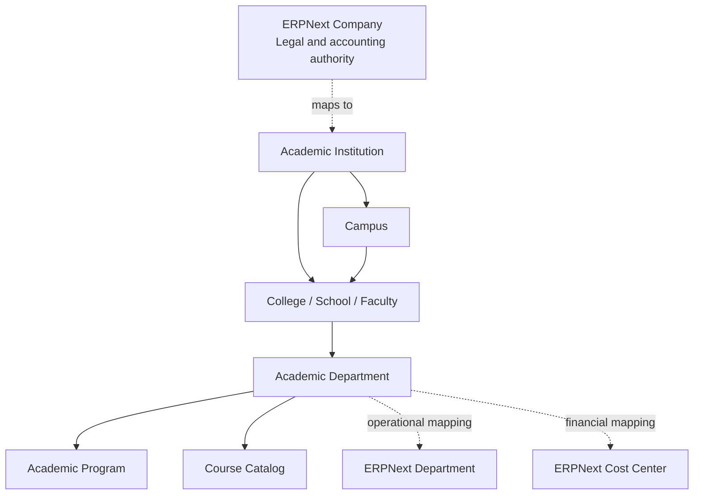

# ADR-003: Institutional and Academic Organization Hierarchy

- **Status:** Accepted
- **Date:** 2026-07-11
- **Accepted:** 2026-07-11 by Prince Ebinezer, Project Owner
- **Decision owners:** Product Architecture, Institutional Administration, Finance and Engineering
- **Supersedes:** None

## Context

Higher-education organization structures serve several distinct purposes:

- legal ownership and accounting;
- campus and location;
- academic governance through colleges, schools, faculties, and departments;
- administrative reporting;
- program and course ownership;
- faculty appointment and teaching assignment; and
- financial responsibility through cost centers and accounting dimensions.

ERPNext provides `Company`, `Department`, `Branch`, `Cost Center`, and accounting dimensions. Education links Program, Course, and Instructor to Department. These records are valuable but do not by themselves provide a complete effective-dated academic-governance model. Forcing every concept into Company or Department would couple academic changes to legal/accounting structure and make historical ownership difficult to reproduce.

## Decision drivers

- Keep ERPNext accounting semantics intact.
- Support institutions, campuses, colleges/schools/faculties, departments, and other academic units.
- Preserve historical ownership after reorganizations.
- Support multi-campus and future multi-institution operation.
- Avoid duplicate hierarchies with unclear authority.
- Map academic ownership to finance, HR, security, and reporting explicitly.

## Options considered

### Option A — Represent every unit as ERPNext Company

**Rejected as the recommendation.** Company represents a legal/accounting entity and creates inappropriate ledger and configuration consequences for ordinary academic units.

### Option B — Represent the entire hierarchy using ERPNext Department

**Rejected as the complete solution.** Department is reusable for operational organization but does not cleanly distinguish campuses, credential-granting units, academic governance types, effective-dated reorganizations, or cross-cutting financial mappings.

### Option C — Build an independent hierarchy and ignore ERPNext organization records

**Rejected.** This creates competing organization masters and weakens accounting, workforce, and reporting integration.

### Option D — Preserve ERPNext authorities and add an effective-dated academic-unit layer

Keep Company, Department, Branch/location, Cost Center, and accounting dimensions authoritative for their standard purposes. Add a Talisma academic-organization concept only for academic governance and map it explicitly to upstream records.

## Decision

Adopt **Option D**, refined by the [Institutional Hierarchy Model](INSTITUTIONAL_HIERARCHY_MODEL.md).

Use a Talisma-owned Institution as the stable security, policy and data-partition root and as ADR-002's `institution_scope` target. Model Campus separately from academic governance. Represent stable Academic Units independently from their versioned parent/child placements so reorganizations do not rewrite history.

### Ownership model

| Concern | Authoritative record |
|---|---|
| Legal entity and accounting books | ERPNext Company |
| Operational/HR department | ERPNext Department |
| Financial responsibility hierarchy | ERPNext Cost Center and accounting dimensions |
| Institutional permission/policy scope | Talisma Institution |
| Physical campus/location | Talisma Campus with optional standard mappings |
| Academic governance hierarchy | Talisma Academic Unit plus versioned Structure/Placement |
| Program and course academic ownership | Effective-dated relationship to academic unit |

`Academic Unit` is a working architectural label, not an approved DocType.

### Academic-unit requirements

- Typed units such as institution, campus, college, school, faculty, department, division, center, or institute.
- Parent/child hierarchy with cycle prevention.
- Effective start and end dates.
- Active/inactive and reorganization history.
- Credential-granting and course-owning indicators.
- Optional mappings to Company, Department, Cost Center, location, and accounting dimensions.
- Leaders and administrators represented through effective-dated assignments rather than copied names.
- Stable institutional codes and separate external-system identifiers.
- Institution scope used consistently by permissions, reports, APIs, and integrations.

## Conceptual structure

The hierarchy must allow institutions that do not use every level; College must not be mandatory between Institution and Department.

## Rules

1. Company is never created merely to represent an academic school or department.
2. Academic reorganizations create effective-dated relationships; they do not rewrite historical program, course, enrollment, transcript, or finance records.
3. Programs and courses store the applicable ownership/version needed for historical reproduction.
4. Permissions derive from explicit institution/unit scope and assigned responsibility, not string prefixes or naming conventions.
5. Financial posting uses approved ERPNext mappings and fails clearly when required mappings are absent.
6. Cross-listed and jointly owned programs/courses use explicit relationship records rather than duplicated masters.
7. Organizational codes are stable identifiers; display names may change with history.

## Consequences

### Positive

- Legal, operational, academic, and financial meanings remain distinct.
- Academic restructuring does not corrupt historical records.
- Multi-campus and multi-institution expansion has a defined path.
- Programs, courses, permissions, reports, and integrations share one academic scope model.

### Negative

- Adds mapping and governance responsibilities.
- Some institutions will maintain both Department and academic-unit relationships.
- Effective dating makes validation and reporting more complex.
- Migration requires resolving inconsistent existing organization data.

## Accepted resolutions

- The domain supports multiple Institutions in one site, while deployment policy may choose separate sites for stronger isolation.
- Talisma Campus is the campus master; Branch is only an optional compatibility mapping.
- Department cannot satisfy the academic-unit requirement because it remains a company-bound operational/HR tree.
- Academic Unit capabilities explicitly control credential, program and course ownership; employment and financial posting remain owned by Employee/Department and Company/Cost Center mappings.
- Joint and cross-campus programs use effective-dated ownership assignments without duplicating the Program master.
- Talisma Institution is the top row-level permission boundary; Academic Unit descendant scope uses an approved structure version.
- Reorganizations create new structure versions and lineage; stable codes are not recycled and historical facts are not rewritten.

## Validation plan

1. Model at least three institutional patterns: single-campus college, multi-campus university, and federated/multi-institution group.
2. Simulate a department merger and program transfer without rewriting history.
3. Validate Company, Department, Cost Center, Program, Course, Employee, and reporting mappings.
4. Perform permission-scope and finance-posting reviews.
5. Approve the conceptual model before creating any DocType.

## References

- [ADR-003 acceptance record](ADR-003-ACCEPTANCE-RECORD.md)
- [ADR-003 approval package](ADR-003-APPROVAL-PACKAGE.md)
- [Standard DocType fit-gap](INSTITUTIONAL_STANDARD_DOCTYPE_FIT_GAP.md)
- [Detailed institutional hierarchy model](INSTITUTIONAL_HIERARCHY_MODEL.md)
- [Governance and validation](INSTITUTIONAL_HIERARCHY_GOVERNANCE.md)
- [Institutional physical schema review gate](INSTITUTIONAL_SCHEMA_REVIEW_GATE.md)
- [Institutional schema Slice A approval](INSTITUTIONAL_SCHEMA_SLICE_A_APPROVAL.md)
- [Institutional schema Slice B1 Campus proposal](INSTITUTIONAL_SCHEMA_SLICE_B1_CAMPUS_PROPOSAL.md)
- [Institutional schema Slice B1 Campus acceptance](INSTITUTIONAL_SCHEMA_SLICE_B1_CAMPUS_ACCEPTANCE.md)
- [Institutional schema Slice B3 Structure proposal](INSTITUTIONAL_SCHEMA_SLICE_B3_STRUCTURE_PROPOSAL.md)
- [Institutional schema Slice B3 Structure acceptance](INSTITUTIONAL_SCHEMA_SLICE_B3_STRUCTURE_ACCEPTANCE.md)
- [Institutional schema Slice B2 Academic Unit proposal](INSTITUTIONAL_SCHEMA_SLICE_B2_ACADEMIC_UNIT_PROPOSAL.md)
- [Institutional schema Slice B2 Academic Unit acceptance](INSTITUTIONAL_SCHEMA_SLICE_B2_ACADEMIC_UNIT_ACCEPTANCE.md)
- [Target architecture](SYSTEM_ARCHITECTURE.md)
- [ERPNext reuse strategy](ERPNEXT_REUSE_STRATEGY.md)
- [Module architecture](../modules/MODULE_ARCHITECTURE.md)
