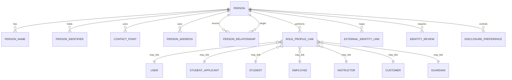
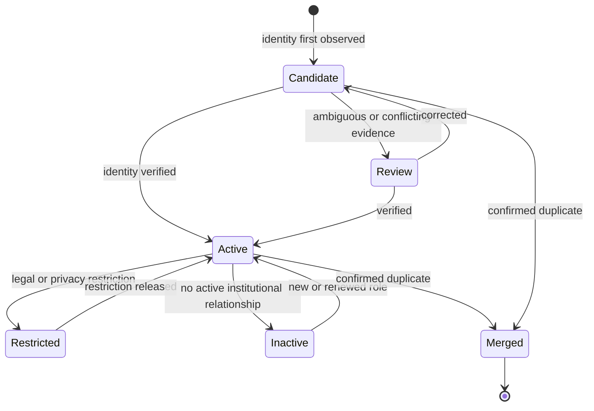
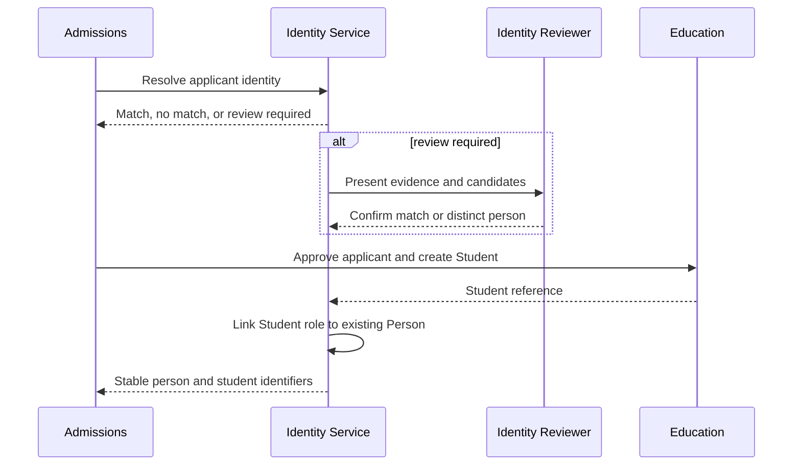
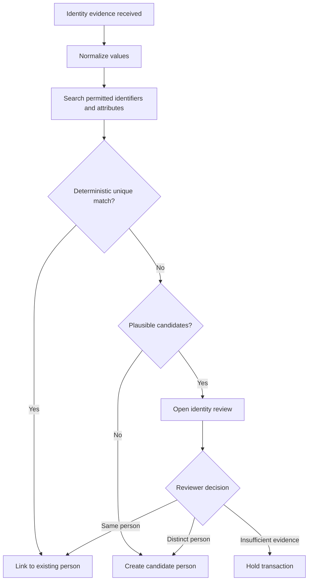

# Identity and Party Model

Status: **Proposed for architecture approval**  
Scope: Conceptual architecture only. This document does not authorize DocTypes, fields, APIs, migrations, or business logic.

## 1. Purpose

Talisma SIS needs one governed view of a human being while preserving the distinct records required by admissions, academics, employment, finance, authentication, and external systems. A person may be an applicant, student, alumnus, employee, instructor, guardian, sponsor, or several of these at once.

This specification refines [ADR-002](ADR-002-IDENTITY-AND-PARTY-MODEL.md). It defines boundaries and lifecycle rules that must be approved before schema design begins.

## 2. Principles

- A person and the roles that person performs are different concepts.
- Authentication (`User`) is not the canonical person record.
- Standard ERPNext and Education role records remain authoritative for their native processes.
- Talisma owns cross-role identity resolution, relationships, privacy controls, and external identifiers.
- Institutional identifiers are immutable once issued; corrections create an audit trail.
- Matching must be explainable. Ambiguous matches require human review.
- Sensitive identity data follows least privilege, purpose limitation, and retention policy.
- Integrations use stable identifiers, not names or email addresses, as durable keys.

## 3. Conceptual model

The names below are conceptual entities, not approved DocType names.

`Person` supplies the stable cross-domain identity. Role-profile links point to standard or future domain records without copying their operational state into the person record.

## 4. Record ownership

| Concern | System of record | Talisma responsibility |
|---|---|---|
| Login, password, sessions, enabled state | Frappe `User` | Provisioning policy and person association |
| Applicant workflow | Education `Student Applicant` or approved admissions model | Identity resolution and admissions extensions |
| Academic student lifecycle | Education `Student` plus Talisma extensions | Cross-role identity, institutional controls, extended lifecycle |
| Employment | ERPNext `Employee` | Person association; do not duplicate HR state |
| Teaching profile | Education `Instructor` and/or ERPNext employee records | Resolve faculty identity and teaching authorization |
| Receivables | ERPNext `Customer` and Accounts | Associate financial party without replacing accounting masters |
| Contact/address mechanics | ERPNext/Frappe `Contact` and `Address` where fit is confirmed | Privacy classification, effective dating, and identity association |
| Canonical person identity | Talisma SIS | Stable identity, names, identifiers, relationships, resolution, audit |
| External system mappings | Talisma SIS | Namespaced external identifiers and synchronization state |

An implementation design must prove that it is not duplicating an authoritative standard field before adding a Talisma field.

## 5. Person lifecycle

Person status does not replace applicant, enrollment, employment, or account status. A person can be inactive while historical student and financial records remain valid. Deletion is exceptional and governed by retention and legal-hold rules.

## 6. Applicant-to-student transition

Conversion must attach a new student role to the existing person rather than create another identity.

The workflow must be idempotent so retries cannot create duplicate role links or institutional identifiers.

## 7. Names, contacts, and addresses

Names need type, effective dates, provenance, script/language where required, and a preferred-display indicator. Legal, preferred, former, and local-script names must not be collapsed into one mutable string.

Contact points and addresses need purpose and visibility classification. Examples include personal, institutional, emergency, billing, mailing, and permanent. Verification state, effective dates, consent, and source should be retained where policy requires them.

Public display names and directory contact details must be derived from explicit disclosure rules, never merely from whichever value was most recently edited.

## 8. Identifiers

Each identifier must include an identifier type, issuing authority or namespace, value, status, issue/expiry dates where applicable, verification state, and sensitivity classification.

Examples include institutional person ID, applicant number, student number, employee number, government identifier, alumni number, and external integration key. Government identifiers must be encrypted or tokenized where appropriate and must never be used as general-purpose display keys.

Uniqueness applies within a defined namespace. Reissued or corrected identifiers are retired, not silently overwritten.

## 9. Identity resolution

Automatic matching should require a trusted, verified, unique identifier. Names, dates of birth, phone numbers, and email addresses may generate candidates but should not independently authorize an automatic merge. Match rules must be versioned and their evidence recorded.

## 10. Merge, split, and correction

A merge requires authorized stewardship, reason, evidence, affected-role preview, and a durable survivor/alias mapping. References must be migrated transactionally or through a recoverable workflow. Authentication, finance, academic history, and external mappings need explicit handling.

A mistaken merge requires a controlled split procedure. Because some downstream transactions cannot be safely separated automatically, the design must support case review and reconciliation rather than promise universal reversal.

Corrections preserve old values, provenance, author, timestamp, and reason according to audit policy.

## 11. Relationships and proxy authority

Relationships are effective-dated, directional, and typed: guardian, parent, dependent, emergency contact, sponsor, adviser, or authorized proxy. A relationship does not itself grant system access.

Proxy authority needs separate scope, consent/legal basis, start and end dates, verification, revocation, and the records or actions covered. For adult students, guardian access is denied by default unless a valid institutional rule or authorization applies.

## 12. Authentication and account provisioning

A person may have zero, one, or—only under an approved federation scenario—multiple user accounts. Account creation occurs when a role and policy require access, not merely because a person record exists.

Single sign-on subject identifiers are stored as namespaced external identity links. Email address changes must not break account association. Disabling a role should revoke role-specific access without destroying the person or historical records.

## 13. Privacy, FERPA, and security

Data is classified at least as public, internal, confidential, or restricted. Government identifiers, credentials, disability/accommodation information, disciplinary information, and protected academic data require additional controls.

Authorization combines role, institutional scope, relationship, purpose, record state, and disclosure restriction. Exports, bulk access, impersonation, identity merges, and sensitive-field views require audit events. Emergency access must be time-bound, justified, and reviewed.

FERPA directory-information preferences are policy inputs; they do not replace field permissions or document permissions. Institutional policy must define eligible-interest rules and jurisdiction-specific requirements.

## 14. Synchronization and events

Role records remain authoritative within their modules. Synchronization should use explicit services and versioned events such as person verified, role linked, identifier issued, contact changed, restriction changed, or person merged.

Consumers must be idempotent, tolerate ordering delays, and store correlation identifiers. Failed synchronization enters an observable retry or reconciliation queue; it must not silently diverge.

## 15. Retention and deletion

Retention is defined by data category, institutional policy, jurisdiction, contractual obligations, litigation hold, and the lifecycle of related academic or financial records. Deactivation and pseudonymization are preferred to destructive deletion where records must remain auditable.

The future schema design must document cascade behavior. No person deletion may orphan academic, financial, employment, consent, audit, or integration records.

## 16. Integration contract

Integrations receive the minimum required attributes, stable internal or scoped external identifiers, data classification, source timestamp, schema version, and correlation identifier. They must not infer identity from display name or email address.

Inbound identity changes are validated against field ownership. A source system cannot overwrite a value it does not own. Conflicts create a review case or follow an approved precedence rule.

## 17. Required scenarios

The schema proposal must demonstrate at least these cases:

1. An applicant becomes a student without duplicate identity.
2. A student is also an employee and instructor.
3. A former student returns under a changed legal name.
4. Twins share address and guardian but retain distinct identities.
5. A guardian has access to one dependent but not another.
6. A sponsor pays charges without gaining academic-record access.
7. An email address changes while SSO identity remains stable.
8. Duplicate people are merged and downstream mappings reconcile.
9. A mistaken merge is escalated for controlled separation.
10. A disclosure restriction removes directory visibility without deleting data.

## 18. Architecture acceptance criteria

Before implementation, reviewers must approve:

- the person-versus-role boundary and system-of-record matrix;
- identifier namespaces, issuance, sensitivity, and correction policy;
- match thresholds, reviewer roles, merge authority, and split procedure;
- guardian/proxy authorization semantics;
- FERPA and privacy enforcement points;
- retention, legal hold, and deletion behavior;
- synchronization ownership, events, and reconciliation;
- multi-institution tenancy and institutional scoping;
- migration strategy for existing Student, Employee, User, Contact, and Address data.

## 19. Open decisions

- Whether standard `Contact` and `Address` satisfy effective dating and privacy requirements without extension.
- Whether the canonical person is a new Talisma DocType or an extension/coordination layer over a standard record.
- Whether Frappe Education is a mandatory runtime dependency; see [ADR-001](ADR-001-FRAPPE-EDUCATION-DEPENDENCY.md).
- How person identifiers are generated in multi-campus and multi-institution deployments.
- Which matching evidence is legally permitted in each deployment jurisdiction.
- Whether organizations require a shared party abstraction now or in a later phase.

## 20. Next architecture deliverables

After this document and ADR-002 are approved, prepare a field-level conceptual data dictionary, permission matrix, lifecycle transition table, identity-resolution rule catalogue, threat model, retention schedule, and migration plan. DocType implementation begins only after those artifacts are reviewed.
