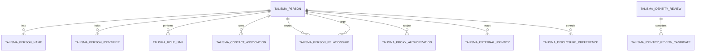

# Identity Physical Schema Proposal

Status: **Proposed; no DocType creation authorized**

This proposal translates accepted ADR-002 concepts into Frappe records. It is intentionally independent of a mandatory Education dependency and is blocked from implementation until the review gate is approved.

## Naming and conventions

- All new records belong to the `talisma_sis` app and Talisma SIS module.
- Canonical record names use server-generated UUIDv4 values; they are not derived from PII and are not user-editable.
- Human-facing institutional numbers live in `Talisma Person Identifier`, not the Person document name.
- Child tables are used only for values that share parent permissions and lifecycle.
- Records needing independent permissions, workflow, unique constraints or audit are standalone DocTypes.
- Institution scope is mandatory where shown, and ADR-003 selects `Talisma Institution` as its conceptual Link target. Physical Link creation waits for the institutional schema dependency.
- Dynamic links use a `Link` field containing the target DocType plus a `Dynamic Link` field containing the document name.

## Relationship overview

## Talisma Person

Standalone, non-submittable canonical natural-person record.

| Field | Frappe type | Required | Index | Semantics |
|---|---|---:|---:|---|
| `name` | System name | Yes | PK | UUIDv4; immutable |
| `display_name` | Data | Yes | Search | Derived cached display value; never identity evidence |
| `lifecycle_status` | Select | Yes | Yes | Candidate, Active, Inactive, Restricted, Merged |
| `verification_status` | Select | Yes | Yes | Unverified, Partial, Verified, Disputed |
| `survivor_person` | Link: Talisma Person | Conditional | Yes | Required only when Merged; immutable afterward |
| `created_source_type` | Data/controlled value | Yes | No | Workflow/integration source category |
| `created_source_reference` | Data | No | No | Non-sensitive source correlation key |
| `restriction_reason_code` | Link: future governed reason | Conditional | No | Restricted access; no free-text legal details |
| `restriction_until` | Datetime | No | Yes | Optional expiry for temporary restrictions |

Framework owner, creation, modified and document-version audit fields are retained. Deletion is denied when any governed link or retained record exists.

### Validation

- Merged requires `survivor_person`, which cannot equal self or resolve to another merged chain without normalization.
- Non-merged records cannot have `survivor_person`.
- Display name is regenerated from the effective preferred/legal name according to policy.
- Lifecycle changes use services with audit reasons; direct bulk editing is prohibited.

## Talisma Person Name

Child table of Talisma Person because name entries share person permissions and lifecycle.

| Field | Type | Required | Semantics |
|---|---|---:|---|
| `name_type` | Select | Yes | Legal, Preferred, Former, Local Script, Alias |
| `prefix` | Data | No | Controlled where configured |
| `given_name` | Data | No | Unicode |
| `middle_name` | Data | No | Unicode |
| `family_name` | Data | No | Unicode |
| `suffix` | Data | No | Controlled where configured |
| `display_value` | Data | Yes | Approved formatted representation |
| `language` | Link: Language | No | Language metadata |
| `script_code` | Data | No | ISO 15924 code validation |
| `valid_from` | Date | No | Effective interval |
| `valid_to` | Date | No | Must not precede start |
| `is_preferred` | Check | Yes | One effective preferred name per context |
| `verification_status` | Select | Yes | Unverified, Verified, Disputed |
| `source_type` | Data/controlled value | Yes | Provenance category |
| `source_reference` | Data | No | Evidence reference, not raw evidence |

Child rows must not contain government identifiers or evidence attachments.

## Talisma Person Identifier

Standalone restricted record to support independent permissions, masking, uniqueness and retention.

| Field | Type | Required | Index/unique | Semantics |
|---|---|---:|---|---|
| `person` | Link: Talisma Person | Yes | Index | Owner identity |
| `institution_scope` | Link: Talisma Institution | Conditional | Index | Required for institution-issued values; depends on institutional schema |
| `identifier_type` | Link: Talisma Identifier Type | Yes | Index | Governed definition |
| `issuer_namespace` | Data | Yes | Composite | Stable issuer namespace |
| `normalized_value_hash` | Data | Yes | Composite unique | Keyed hash for equality/uniqueness; never displayed |
| `masked_value` | Data | Yes | No | Safe display representation |
| `protected_value` | Password/encrypted value | Conditional | No | Only when recoverable value is approved and required |
| `status` | Select | Yes | Index | Active, Retired, Replaced, Disputed |
| `issued_on` | Date | No | No | Validity metadata |
| `expires_on` | Date | No | Index | Optional expiry |
| `verification_status` | Select | Yes | Index | Unverified, Verified, Disputed |
| `verified_on` | Datetime | Conditional | No | Required when verified |
| `replaced_by` | Link: Talisma Person Identifier | No | Index | Lineage |

Database uniqueness must cover issuer namespace, identifier type and normalized hash for non-retired identifiers. Because Frappe metadata cannot express a conditional composite unique constraint portably, the implementation design must combine validation, transaction locking and an app-owned database index/constraint patch reviewed for MariaDB compatibility.

## Talisma Identifier Type

Governed master record, not freely created during identity entry.

| Field | Type | Required | Semantics |
|---|---|---:|---|
| `type_code` | Data | Yes/unique | Immutable machine code |
| `title` | Data | Yes | User-facing label |
| `classification` | Select | Yes | Internal, Confidential, Restricted |
| `scope_rule` | Select | Yes | Global issuer, institution issuer, external system |
| `normalization_rule` | Select | Yes | Approved implementation rule identifier |
| `recoverable_value_allowed` | Check | Yes | Default false |
| `automatic_match_allowed` | Check | Yes | Requires verified trusted issuer |
| `retention_policy_code` | Data | Yes | Approved policy reference |
| `disabled` | Check | Yes | Prevent new issuance without deleting history |

## Talisma Role Link

Standalone link from Person to a standard or future domain profile.

| Field | Type | Required | Index/unique | Semantics |
|---|---|---:|---|---|
| `person` | Link: Talisma Person | Yes | Index | Canonical identity |
| `profile_doctype` | Link: DocType | Yes | Composite | Allowlisted target type |
| `profile_name` | Dynamic Link | Yes | Composite unique | Target document |
| `role_type` | Select/Link master | Yes | Index | User, Applicant, Student, Employee, Instructor, Customer, Guardian, other approved |
| `institution_scope` | Link: Talisma Institution | Conditional | Index | Required for scoped roles; depends on institutional schema |
| `status` | Select | Yes | Index | Pending, Active, Inactive, Disputed, Replaced |
| `valid_from` | Date | No | Index | Association interval |
| `valid_to` | Date | No | Index | Association interval |
| `source_type` | Data/controlled value | Yes | No | Workflow/integration/manual |
| `source_reference` | Data | No | No | Correlation key |
| `replaced_by` | Link: Talisma Role Link | No | No | Correction lineage |

Exactly one non-replaced link may exist for a target DocType/name. The target DocType must be allowlisted; arbitrary Dynamic Links are prohibited. Education target types are enabled only when the app is installed and ADR-001 permits use.

## Talisma Contact Association

Standalone association to standard `Contact` or `Address`.

| Field | Type | Required | Semantics |
|---|---|---:|---|
| `person` | Link: Talisma Person | Yes | Canonical identity |
| `record_type` | Select | Yes | Contact or Address |
| `record_name` | Dynamic Link | Yes | Existing standard record |
| `purpose` | Select/controlled master | Yes | Personal, Institutional, Emergency, Mailing, Permanent, Billing |
| `valid_from` | Date | No | Effective interval |
| `valid_to` | Date | No | Effective interval |
| `verification_status` | Select | Yes | Unverified, Verified, Disputed |
| `disclosure_class` | Select | Yes | Directory, Internal, Confidential, Restricted |
| `is_preferred` | Check | Yes | Unique effective preference per purpose |
| `consent_reference` | Data | No | Policy/grant reference; no secret value |
| `source_type` | Data/controlled value | Yes | Provenance |

No contact detail is copied into this association. Permission checks apply both to the association and referenced standard record.

## Deferred standalone DocTypes

These records are architecturally defined but excluded from the first implementation slice:

### Talisma Person Relationship

Source person, target person, relationship type, institution scope, effective interval, verification, status, authority basis and provenance. A relationship never grants access.

### Talisma Proxy Authorization

Grantor, subject, proxy, institution scope, legal/consent basis, allowed record categories/actions, interval, revocation, reviewer and evidence reference. Independent workflow and restricted permissions are mandatory.

### Talisma External Identity

Person, system namespace, external subject, institution scope, status, ownership contract version and synchronization state. Namespace plus external subject is unique. Email is prohibited as the durable subject.

### Talisma Disclosure Preference

Person, institution scope, policy version, directory categories, suppression state, effective interval, source and audit reason.

### Talisma Identity Review

Case type/status, institution scope, rule version, evidence snapshot reference, decision/reason, reviewers, affected roles, correlation ID and reconciliation status. Candidate child rows reference considered people and non-sensitive score/reason summaries.

## Deletion and referential behavior

- Use restrictive deletion for Person and all standalone identity records.
- Merges mark the losing Person `Merged` and retain a survivor reference; they do not hard-delete it.
- Role/profile target deletion is blocked or requires an explicit unlink/correction workflow.
- Standard Contact/Address deletion must be blocked while an active governed association exists.
- Child names are removed only under the parent retention workflow.
- Framework rename is disabled for UUID-named identity records.

## First implementation slice

Only the following may be considered after this schema is approved:

1. `Talisma Person`.
2. `Talisma Person Name` child table.
3. `Talisma Identifier Type` with controlled seed records.
4. `Talisma Person Identifier` for non-government institutional identifiers only.
5. `Talisma Role Link` initially allowlisting `User`, `Employee`, `Customer`, `Contact`-independent roles available without Education.
6. `Talisma Contact Association` only after standard-field permission tests.

Excluded from the first slice: automatic matching, merging, split recovery, proxy portal access, government identifiers, evidence files, bulk migration, external write APIs and Education-specific links.
