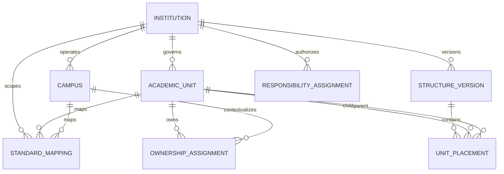

# Talisma Institutional Hierarchy Model

Status: **Accepted architecture baseline under ADR-003; no schema authorized**

## Decision proposal

Adopt a Talisma-owned `Institution` as the stable security, policy and data-partition root. Keep legal entities, campuses, academic governance units, operational departments and financial responsibility as separate concepts joined by explicit mappings.

One Frappe site may host multiple Institutions, subject to strict server-side scope enforcement. Deployments that require stronger legal or operational isolation may still place institutions on separate sites; the domain model must not prevent either topology.

## Conceptual model

## Talisma Institution

The stable root for institutional policy, identifiers, permissions, integrations and reporting.

Required semantics:

- immutable opaque internal key;
- unique stable institution code;
- legal/display names with controlled history;
- active interval and lifecycle status;
- default locale, timezone and policy references;
- optional external identifiers;
- no embedded chart-of-accounts or legal-company behavior.

This is the selected Link target for ADR-002 `institution_scope` fields.

## Talisma Campus

A stable physical/operational campus identity scoped to one Institution.

Required semantics:

- institution and unique code within institution;
- name, campus type and active interval;
- timezone and location/address association;
- optional parent campus only for physical grouping, with cycle prevention;
- optional Branch/location/facility mappings;
- no academic ownership implied by physical location.

Online/virtual delivery may use a typed virtual campus when operationally needed, but it must not become a catch-all for academic units.

## Talisma Academic Unit

A stable academic-governance identity scoped to one Institution. Unit identity does not embed a permanent parent.

Types include college, school, faculty, academic department, division, institute, center and other governed types. Institution and Campus are not Academic Unit types because they have distinct policy and location semantics.

Required semantics:

- institution and stable unique unit code;
- current display name and controlled name history;
- governed unit type;
- active interval/status;
- flags/capabilities such as credential granting, program ownership and course ownership;
- no copied leader name, Department, Company or Cost Center;
- no mutable tree parent on the unit master.

## Structure Version and Unit Placement

Academic hierarchy is versioned rather than rewritten in place.

`Structure Version` belongs to one Institution and has a unique code, status (Draft, Approved, Active, Retired), effective interval and approval record. Effective intervals for active versions cannot overlap unless a clearly named alternative hierarchy purpose is introduced later.

`Unit Placement` associates one child Academic Unit with an optional parent Academic Unit inside one structure version. Rules:

- both units belong to the structure's Institution;
- a unit has at most one governance parent per version;
- no cycles;
- a root unit may omit parent;
- placement cannot make an inactive unit active;
- approved/active versions are immutable; corrections create a superseding version;
- hierarchy depth is configurable and no college level is mandatory.

Versioning avoids corrupting history during mergers, splits, transfers and renames while allowing an efficient current hierarchy to be materialized or cached for permission queries.

## Standard mappings

Mappings connect Institution, Campus or Academic Unit to an allowlisted standard target:

- Company for legal/accounting responsibility;
- Department for HR/operational alignment;
- Branch for optional operational compatibility;
- Cost Center for financial responsibility;
- future Location/facility records after fit-gap.

Each mapping includes institution, source type/key, target DocType/name, mapping purpose, primary flag, effective interval, status and provenance. Cardinality is purpose-specific; no generic one-to-one assumption is allowed.

## Academic ownership assignment

Programs, courses, curricula and other academic objects receive effective-dated ownership assignments rather than a mutable department field being treated as historical truth.

Required semantics:

- institution;
- target DocType/name from an allowlist;
- academic unit;
- ownership role: Primary, Joint, Administrative, Curriculum, Delivery;
- optional campus context;
- effective interval;
- applicable structure version;
- allocation percentage only where policy defines its meaning;
- approval and provenance.

Exactly one effective Primary owner is required when the target's policy demands it. Joint ownership does not duplicate the Program or Course master.

## Responsibility assignment

Leaders, administrators and delegated scope are effective-dated assignments linking a Person/Employee/User-derived actor to Institution or Academic Unit with a governed responsibility type. Names and user IDs are not copied onto organizational masters.

Responsibility can inform authorization but does not independently grant access; role, institution scope and permission policy still apply.

## Permission scope

Institution is the mandatory top-level boundary. Academic Unit scope is evaluated within a selected active structure version. Permission grants specify:

- institution;
- optional academic unit;
- include-descendants flag;
- responsibility/purpose;
- effective interval;
- data-domain restrictions;
- source and approval.

Descendant expansion uses the approved structure version, not Department name prefixes. Cross-institution access is denied by default and requires an explicit central/shared-service grant.

## Reorganization rules

1. Codes are stable and never recycled.
2. Display-name changes create history without changing identity.
3. Parent changes occur in a new structure version.
4. Mergers create successor/predecessor relationships; units are not silently renamed into one another.
5. Splits create new units and explicit lineage.
6. Historical Program/Course ownership and transactions retain their effective assignment/version.
7. Financial mappings are separately approved and cannot be inferred from academic placement.
8. Permission grants are reviewed when a new structure becomes active; scope is not silently widened.

## Institutional patterns

### Single-campus college

One Institution, one Campus, optional top-level schools/departments, one or more mapped Companies. Academic hierarchy may place departments directly at the root.

### Multi-campus university

One Institution, multiple Campuses, academic units that may operate across campuses, and delivery/ownership assignments carrying campus context without duplicating units.

### Federated group

Multiple Institutions in one site, each with independent policy/security root, campuses and structures. Shared services use explicit cross-institution responsibility grants. Legal Companies may map according to actual accounting arrangements without collapsing institutional security boundaries.

## Historical query rule

Every transaction or effective-dated domain record that requires reproducible organizational reporting must store or deterministically resolve the applicable Institution, Academic Unit ownership assignment and structure version. Reports must accept an “as of” date and must not project today's hierarchy onto historical facts unless explicitly requested.

## Implementation boundary

Approval of this model will unblock the identity schema's `institution_scope` target, but it will not authorize DocType creation. A later physical-schema gate must specify exact fields, indexes, hierarchy-cache strategy, permission queries, mapping constraints and migration behavior.
