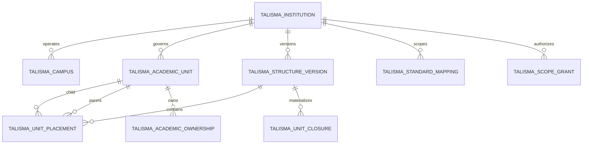

# Institutional Physical Schema Proposal

Status: **Partially approved: Slices A, B1, B2, B3, and B4 accepted; later slices not authorized**

This proposal translates accepted ADR-003 into Frappe records. Names and fields are exact design candidates but remain unapproved until the institutional schema review gate is accepted.

## Conventions

- All records belong to the `talisma_sis` app and Talisma SIS module.
- Core domain records use server-generated UUIDv4 document names; no PII or mutable code appears in `name`.
- Human-facing codes are explicit immutable fields, unique within their defined scope and never recycled.
- Composite uniqueness requires reviewed MariaDB indexes/constraints plus transactional validation because ordinary DocType field flags cannot express every scoped rule.
- Dates use half-open intervals: effective at `valid_from`, no longer effective after `valid_to`; null end means open-ended.
- Historical approved structures are immutable.
- Education-specific Dynamic Link targets are disabled while ADR-001 remains unaccepted.

## Entity overview

## Talisma Institution

Standalone, non-submittable root for security, policy and data partitioning. This is the physical target required by ADR-002 `institution_scope` fields.

| Field | Frappe type | Required | Index/unique | Semantics |
|---|---|---:|---|---|
| `name` | System name | Yes | PK | UUIDv4, immutable |
| `institution_code` | Data | Yes | Unique | Stable uppercase machine code; immutable |
| `institution_name` | Data | Yes | Search index | Current display name |
| `legal_name` | Data | No | No | Informational; Company remains legal/accounting owner |
| `short_name` | Data | No | Search index | Display abbreviation, not identity key |
| `status` | Select | Yes | Index | Planned, Active, Inactive, Closed |
| `valid_from` | Date | Yes | Index | Start of institutional validity |
| `valid_to` | Date | No | Index | Must not precede start |
| `default_timezone` | Autocomplete/Data | Yes | No | Valid IANA timezone |
| `default_language` | Link: Language | No | No | Default presentation language |
| `country` | Link: Country | No | Index | Policy/reporting context, not Company ownership |
| `website` | Data | No | No | URL validation |
| `primary_address` | Link: Address | No | No | Standard address; governed deletion |
| `policy_profile_code` | Data | No | No | Deferred from Slice A until a policy-profile schema is approved |

### Rules

- `institution_code` is normalized before uniqueness checks and cannot change after insert.
- Closed/Inactive Institutions remain referenceable historically.
- Deletion is denied after any Campus, Unit, identity scope, mapping, assignment or transaction exists.
- Company is never auto-created from Institution.

## Talisma Campus

Standalone physical/operational campus scoped to exactly one Institution.

| Field | Type | Required | Index/unique | Semantics |
|---|---|---:|---|---|
| `name` | System name | Yes | PK | UUIDv4 |
| `institution` | Link: Talisma Institution | Yes | Composite index | Security root |
| `campus_code` | Data | Yes | Composite unique | Stable code within Institution |
| `campus_name` | Data | Yes | Search index | Display name |
| `short_name` | Data | No | Search index | Display abbreviation |
| `campus_type` | Select | Yes | Index | Main, Satellite, Learning Center, Virtual, Other |
| `status` | Select | Yes | Index | Planned, Active, Inactive, Closed |
| `valid_from` | Date | Yes | Index | Effective start |
| `valid_to` | Date | No | Index | Effective end |
| `timezone` | Autocomplete/Data | Yes | No | Valid IANA timezone |
| `address` | Link: Address | Conditional | No | Required except approved Virtual campus |
| `website` | Data | No | No | Valid HTTP or HTTPS URL |

Unique constraint: `(institution, normalized campus_code)`. Campus placement does not imply academic ownership. `parent_campus` is deferred with the facilities model, and Virtual behavior derives from `campus_type` rather than a duplicate flag. Exact Slice B1 rules are defined in the [Campus proposal](INSTITUTIONAL_SCHEMA_SLICE_B1_CAMPUS_PROPOSAL.md).

## Talisma Academic Unit Type

Governed configuration master.

The exact accepted Slice B2 boundary is defined in the [Academic Unit Type and Academic Unit proposal](INSTITUTIONAL_SCHEMA_SLICE_B2_ACADEMIC_UNIT_PROPOSAL.md) and [acceptance record](INSTITUTIONAL_SCHEMA_SLICE_B2_ACADEMIC_UNIT_ACCEPTANCE.md).

| Field | Type | Required | Semantics |
|---|---|---:|---|
| `type_code` | Data | Yes/unique | Immutable code |
| `type_name` | Data | Yes | College, School, Faculty, Department, Division, Institute, Center, Other |
| `can_grant_credentials` | Check | Yes | Capability default |
| `can_own_programs` | Check | Yes | Capability default |
| `can_own_courses` | Check | Yes | Capability default |
| `disabled` | Check | Yes | Prevent new usage; retain history |

Capabilities on a Unit may narrow but cannot broaden its type defaults without an approved exception record.

## Talisma Academic Unit

Stable academic-governance identity without a mutable parent field.

| Field | Type | Required | Index/unique | Semantics |
|---|---|---:|---|---|
| `name` | System name | Yes | PK | UUIDv4 |
| `institution` | Link: Talisma Institution | Yes | Composite index | Owning scope |
| `unit_code` | Data | Yes | Composite unique | Stable within Institution |
| `unit_name` | Data | Yes | Search index | Current display name |
| `short_name` | Data | No | Search index | Display abbreviation |
| `unit_type` | Link: Talisma Academic Unit Type | Yes | Index | Governed type |
| `status` | Select | Yes | Index | Planned, Active, Inactive, Closed |
| `valid_from` | Date | Yes | Index | Effective start |
| `valid_to` | Date | No | Index | Effective end |
| `can_grant_credentials` | Check | Yes | Index | Constrained by type/policy |
| `can_own_programs` | Check | Yes | Index | Constrained by type/policy |
| `can_own_courses` | Check | Yes | Index | Constrained by type/policy |

Unique constraint: `(institution, normalized unit_code)`. Name changes are audited; codes do not change. Merge, split, successor and lineage semantics remain deferred to a later slice.

## Talisma Structure Version

Submittable institutional hierarchy version. Submission is approval and immutability boundary.

| Field | Type | Required | Index/unique | Semantics |
|---|---|---:|---|---|
| `name` | System name | Yes | PK | UUIDv4 |
| `institution` | Link: Talisma Institution | Yes | Composite index | Scope |
| `structure_code` | Data | Yes | Composite unique | Stable version code within Institution/purpose |
| `structure_name` | Data | Yes | Search | Display title |
| `structure_purpose` | Select | Yes | Composite index | Academic Governance initially |
| `valid_from` | Date | Yes | Composite index | Activation date |
| `valid_to` | Date | Conditional | Composite index | Optional in Draft; required on submit; exclusive end |
| `supersedes` | Link: Talisma Structure Version | No | Index | Same Institution/purpose |
| `change_summary` | Small Text | Yes | No | Human review summary |
| `approval_reference` | Data | Yes | No | Governance decision reference |

### Rules

- Draft versions can change placements; submitted versions and their placements cannot.
- Submitted effective intervals cannot overlap for the same Institution/purpose.
- Submission requires complete validation and impact report.
- A submitted version cannot be cancelled after it has governed transactions or permission decisions; supersede instead.
- B3 submission approves and freezes the structure but does not make it active or usable by consumers. Materialization and activation fields are deferred to the Closure/activation slice.
- Exact B3 rules are defined in the [Structure Version and Unit Placement proposal](INSTITUTIONAL_SCHEMA_SLICE_B3_STRUCTURE_PROPOSAL.md).
- Submitted B3 Structures must be bounded as recorded in the [valid-to amendment](INSTITUTIONAL_SCHEMA_SLICE_B3_VALID_TO_AMENDMENT.md).

## Talisma Unit Placement

Standalone record for queryability and scale; immutable when its Structure Version is submitted.

| Field | Type | Required | Index/unique | Semantics |
|---|---|---:|---|---|
| `structure_version` | Link: Talisma Structure Version | Yes | Composite unique | Version |
| `institution` | Link: Talisma Institution | Yes | Index | Denormalized validated scope |
| `academic_unit` | Link: Talisma Academic Unit | Yes | Composite unique | Child unit |
| `parent_unit` | Link: Talisma Academic Unit | No | Index | Null for root |
| `display_order` | Int | No | No | Sibling presentation only |

Unique `(structure_version, academic_unit)`. Both units must share Institution. Self-parent and cycles are rejected. Unit validity must cover the structure interval where required by policy.

## Talisma Unit Closure

System-managed materialized transitive closure for descendant permission and reporting queries. Users cannot create/edit/delete these records directly.

The accepted [B4 Closure proposal](INSTITUTIONAL_SCHEMA_SLICE_B4_CLOSURE_PROPOSAL.md) and [acceptance record](INSTITUTIONAL_SCHEMA_SLICE_B4_CLOSURE_ACCEPTANCE.md) supersede this preliminary shape by introducing an explicit Closure Build generation record. B4 implementation must follow those accepted documents exactly.

| Field | Type | Required | Index/unique | Semantics |
|---|---|---:|---|---|
| `structure_version` | Link: Talisma Structure Version | Yes | Composite unique | Version |
| `institution` | Link: Talisma Institution | Yes | Composite index | Scope |
| `ancestor_unit` | Link: Talisma Academic Unit | Yes | Composite unique/index | Ancestor |
| `descendant_unit` | Link: Talisma Academic Unit | Yes | Composite unique/index | Descendant, including self |
| `depth` | Int | Yes | Index | Zero for self, positive below |
| `build_id` | Data | Yes | Index | Atomic materialization generation |

Unique `(structure_version, ancestor_unit, descendant_unit)`. Build in a transaction/staged generation; mark version Ready only after count, cycle and integrity checks. Never treat closure rows as authoritative history—the submitted placements are authoritative.

## Talisma Standard Mapping

Effective-dated mapping from Institution, Campus or Academic Unit to allowlisted ERPNext records.

| Field | Type | Required | Index/unique | Semantics |
|---|---|---:|---|---|
| `institution` | Link: Talisma Institution | Yes | Index | Security scope |
| `source_type` | Select | Yes | Composite index | Institution, Campus, Academic Unit |
| `source_name` | Dynamic Link | Yes | Composite index | Validated source |
| `target_doctype` | Link: DocType | Yes | Composite index | Company, Department, Branch, Cost Center only initially |
| `target_name` | Dynamic Link | Yes | Composite index | Existing standard target |
| `mapping_purpose` | Select | Yes | Composite index | Legal, HR, Operations, Payroll, Billing, Budget, Procurement, Reporting |
| `is_primary` | Check | Yes | Index | Singular only where purpose policy requires |
| `valid_from` | Date | Yes | Index | Effective start |
| `valid_to` | Date | No | Index | Effective end |
| `status` | Select | Yes | Index | Draft, Active, Inactive, Disputed |
| `source_reference` | Data | Yes | No | Provenance/approval reference |

Validation checks target Company consistency for Department/Cost Center and prevents overlapping primary mappings where policy requires one.

## Talisma Academic Ownership

Effective ownership of allowlisted academic objects.

| Field | Type | Required | Index/unique | Semantics |
|---|---|---:|---|---|
| `institution` | Link: Talisma Institution | Yes | Index | Scope |
| `target_doctype` | Link: DocType | Yes | Composite index | Allowlisted Program, Course, Curriculum or future master |
| `target_name` | Dynamic Link | Yes | Composite index | Owned record |
| `academic_unit` | Link: Talisma Academic Unit | Yes | Index | Owner |
| `ownership_role` | Select | Yes | Index | Primary, Joint, Administrative, Curriculum, Delivery |
| `campus` | Link: Talisma Campus | No | Index | Delivery/context only |
| `structure_version` | Link: Talisma Structure Version | Yes | Index | Historical hierarchy context |
| `valid_from` | Date | Yes | Composite index | Effective start |
| `valid_to` | Date | No | Composite index | Effective end |
| `allocation_percent` | Percent | No | No | Only where approved meaning exists |
| `approval_reference` | Data | Yes | No | Governance evidence |
| `status` | Select | Yes | Index | Draft, Active, Inactive, Disputed |

Exactly one effective Primary owner per target when required. Joint percentages are optional unless policy explicitly requires totals.

## Talisma Scope Grant

Effective organizational scope assigned to a User for server-side authorization.

| Field | Type | Required | Index/unique | Semantics |
|---|---|---:|---|---|
| `user` | Link: User | Yes | Composite index | Actor |
| `institution` | Link: Talisma Institution | Yes | Composite index | Mandatory boundary |
| `academic_unit` | Link: Talisma Academic Unit | No | Index | Optional narrower root |
| `structure_version` | Link: Talisma Structure Version | Conditional | Index | Required for unit descendant scope |
| `include_descendants` | Check | Yes | Index | Uses closure table |
| `scope_purpose` | Link/controlled value | Yes | Index | Registrar, advising, reporting, administration, etc. |
| `valid_from` | Datetime | Yes | Index | Effective start |
| `valid_to` | Datetime | No | Index | Expiry |
| `status` | Select | Yes | Index | Pending, Active, Revoked, Expired |
| `approval_reference` | Data | Yes | No | Authorization evidence |

This supplements rather than replaces Frappe roles. A generic role without an effective Scope Grant confers no institutional data scope.

## Deferred records

- Unit Name History.
- Unit Lineage for merge/split many-to-many predecessor/successor relationships.
- Responsibility Assignment linked to approved Person/Employee/User actors.
- External Organization Identifier.
- Building/facility hierarchy.
- Structure impact/reconciliation case.

## Deletion and rename policy

- UUID names cannot be renamed.
- Institution, Campus and Academic Unit use restrictive deletion after reference.
- Codes cannot change or be reused.
- Submitted Structure Versions, Placements and their authoritative audit are immutable.
- Closure rows may be atomically rebuilt from submitted placements.
- Mapping/ownership/grant records are ended or revoked, not deleted after use.

## Minimal implementation slices

### Slice A: institutional scope foundation

1. Talisma Institution only.
2. Minimal institution-scoped permission tests.
3. No identity Link-field migration until dependency installation order and rollback are tested.

### Slice B: current academic structure

1. Slice B1 approves Campus independently through the [Campus proposal](INSTITUTIONAL_SCHEMA_SLICE_B1_CAMPUS_PROPOSAL.md) and [acceptance record](INSTITUTIONAL_SCHEMA_SLICE_B1_CAMPUS_ACCEPTANCE.md).
2. Slice B2 approves Academic Unit Type and Academic Unit through the [B2 proposal](INSTITUTIONAL_SCHEMA_SLICE_B2_ACADEMIC_UNIT_PROPOSAL.md) and [acceptance record](INSTITUTIONAL_SCHEMA_SLICE_B2_ACADEMIC_UNIT_ACCEPTANCE.md).
3. Slice B3 approves Structure Version and Unit Placement through the [B3 proposal](INSTITUTIONAL_SCHEMA_SLICE_B3_STRUCTURE_PROPOSAL.md) and [acceptance record](INSTITUTIONAL_SCHEMA_SLICE_B3_STRUCTURE_ACCEPTANCE.md).
4. Unit Closure materialization and Scope Grant permission enforcement require a separate approval.

### Slice C: integrations

1. Standard Mapping.
2. Academic Ownership.
3. Optional Education adapters only after ADR-001 acceptance.

Reorganization automation, lineage, responsibility assignments and production migration remain excluded until later approval.
