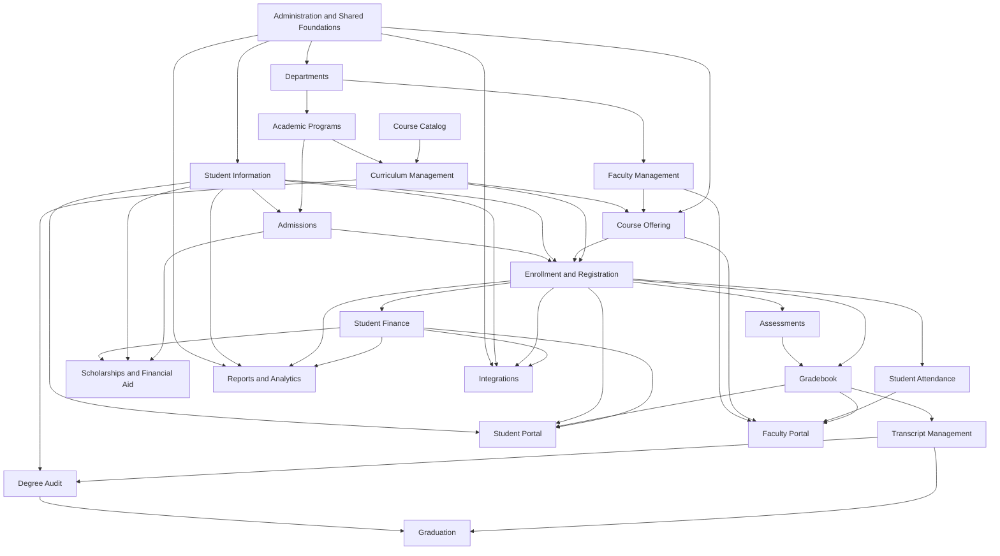

# Module Dependency Map

Status: **Proposed**

The arrows below mean “requires services or authoritative records from,” not Python import direction.

## Dependency rules

1. Shared foundations cannot depend on a downstream academic module.
2. Portals orchestrate module services; they do not own authoritative academic data.
3. Reports consume governed records; they do not repair or mutate them.
4. Integrations call application services rather than bypassing validation through direct inserts.
5. Student Finance posts to ERPNext Accounts and does not implement a second ledger.
6. Transcript and degree-audit results depend on finalized academic attempts, not mutable display grades.
