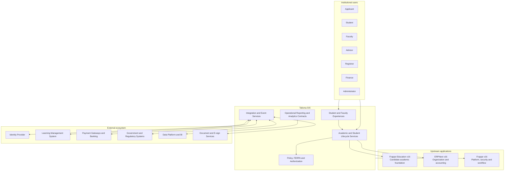
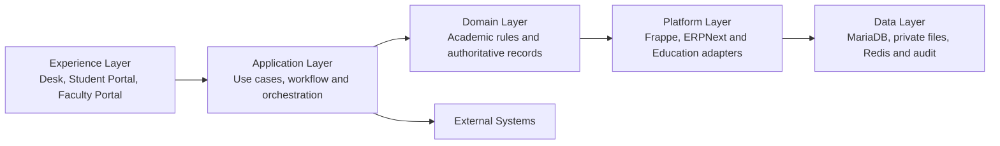

# Talisma SIS Target Architecture

Status: **Proposed for architecture approval**
Scope: Product and module architecture only; no schema or implementation is authorized by this document.

## 1. Architectural decision

Talisma SIS will be an upgrade-safe higher-education product composed of four ownership layers:

1. **Frappe Framework** owns the application platform: users, roles, permissions, workflows, audit trail, files, communications, background jobs, metadata, reports, and API transport.
2. **ERPNext** owns enterprise records: companies, departments, employees, customers, items, accounts, cost centers, invoices, payments, and the general ledger.
3. **Frappe Education v16** is a candidate upstream academic dependency for reusable school-oriented records and services. It is not currently installed and must pass the dependency gate described below.
4. **Talisma SIS** owns higher-education policy, institutional academic records, student lifecycle orchestration, privacy controls, portals, and integrations that are not adequately represented upstream.

No Frappe, ERPNext, or Education source will be modified. Talisma will use public hooks, document events, class extension, custom fields owned by the app, services, permissions, and APIs.

## 2. Evidence baseline

The installed ERPNext v16.26.2 source has no Education module. The official Education app was separated from ERPNext and its `version-16` branch declares Frappe `>=16,<17` compatibility and `required_apps = ["erpnext"]`.

The reviewed Education v16 source provides one Education workspace; Student, Guardian, Instructor, Program, Course, Academic Year and Term; admission and enrollment records; scheduling, attendance, assessment, fee, quiz, portal, and reporting features. Its published compatibility matrix maps `version-16` to Frappe v16.

Primary sources:

- <https://github.com/frappe/education/tree/version-16>
- <https://github.com/frappe/education/blob/version-16/education/hooks.py>
- <https://github.com/frappe/education/blob/version-16/pyproject.toml>
- <https://github.com/frappe/education>

## 3. System context

## 4. Logical architecture

### Experience layer

- Talisma workspaces for registrar, admissions, advising, finance, and administration.
- Purpose-built student and faculty portals.
- Permission-aware reports, dashboards, print formats, and notifications.

### Application layer

- Explicit services for registration, curriculum evaluation, grading, billing orchestration, transcript production, and graduation.
- Frappe workflows for human decisions; domain state machines for invariant lifecycle rules.
- Background jobs for bulk processing and external integration.

### Domain layer

- Effective-dated academic structures and policies.
- Immutable or auditable academic transactions.
- Clear ownership boundaries between academic, identity, and financial records.

### Platform layer

- Adapters around upstream DocTypes rather than direct behavioral forks.
- Frappe permission-query and document-level authorization.
- ERPNext accounting documents as financial truth.

## 5. Core domain boundaries

### Identity and party model

`User` is authentication identity, `Contact` and `Address` are shared contact records, `Employee` is the employment record, `Instructor` is the teaching profile, and `Student` is the academic identity. These records may refer to the same person but must not be merged into one overloaded DocType.

The proposed cross-role identity boundary, ownership rules, lifecycle, privacy controls, and resolution workflow are defined in the [Identity and Party Model](IDENTITY_AND_PARTY_MODEL.md). That specification remains conceptual until ADR-002 is accepted.

Talisma must define a duplicate-prevention and identity-linking policy before admissions implementation. Government identifiers and sensitive identity evidence must not be used as document names.

### Institutional model

ERPNext `Company` remains the legal/accounting entity. `Department` can represent operating departments where its hierarchy is sufficient. Talisma will introduce higher-education academic-unit concepts only if schools, colleges, faculties, campuses, or governance relationships cannot be represented safely by Department.

### Academic time

Education `Academic Year` and `Academic Term` are reusable candidates. Talisma must add policy concepts such as careers, sessions, registration periods, census dates, grading periods, and effective dating without changing upstream core.

### Academic structure

Education `Program` and `Course` are reusable identities. Talisma owns curriculum versions, requirements, course versions, offerings/sections, registration transactions, credit attempts, repeat rules, transfer work, degree audit, transcript, and conferral.

### Finance

ERPNext Accounts is authoritative for receivables, invoices, payments, refunds, accounts, cost centers, currencies, and ledger postings. Talisma owns academic charge assessment, student-account presentation, sponsorship, aid, and the mapping from academic events to accounting documents.

## 6. Record design rules

- Separate a reusable identity/master from an effective-dated version and from a transaction.
- Never overwrite historical curriculum, course, grade, enrollment, or conferral facts to reflect current policy.
- Store the policy/version used by consequential calculations.
- Make registration, grade, transcript, and award recalculation explainable.
- Prefer submitted or append-only records for finalized academic outcomes.
- Use explicit status transitions and reason codes for consequential changes.
- Preserve source, actor, timestamp, and authorization for overrides.

## 7. Security and FERPA architecture

- Authorization is enforced server-side at query and document level.
- Roles express job functions; user permissions and relationships constrain institutional scope.
- Faculty access derives from active teaching/advising assignments, not a broad faculty role alone.
- Student access is restricted to the authenticated student's records.
- Sensitive categories such as advising notes, disability information, conduct, financial aid, and identity evidence require separate access policies.
- Disclosure restrictions and directory-information choices must affect exports, reports, portals, and APIs.
- Integration identities receive narrowly scoped access and all consequential changes are auditable.
- Attachments containing protected records remain private.

## 8. API and integration architecture

- Internal UI calls may use Frappe document APIs where permission semantics are sufficient.
- Talisma business operations use named service endpoints rather than exposing multi-document orchestration as generic CRUD.
- External APIs are versioned, idempotent where they mutate state, and return stable DTOs rather than raw internal documents.
- Integration events use an outbox-style durable record before delivery when loss would be consequential.
- Bulk imports use staged validation and reconciliation rather than direct inserts.
- External identifiers, source systems, correlation IDs, retry state, and last successful synchronization are explicit.

Education's current whitelisted methods for enrollment, attendance, assessments, portal context, schedules, fees, and billing are reusable only behind a reviewed Talisma adapter; they are not a stable external contract for Talisma consumers.

## 9. Reporting architecture

- Operational reports query governed transactional data with normal Frappe permissions.
- High-volume institutional analytics use documented extracts or events into a governed analytical store.
- Metric definitions, grain, effective date, privacy classification, and refresh frequency are documented.
- Direct external access to the transactional MariaDB database is prohibited.

## 10. Dependency approval gate

Frappe Education must not become a production dependency until all of the following are approved:

1. Pin and test a specific `version-16` release against the exact Frappe/ERPNext image versions.
2. Inventory field semantics and migration behavior for every reused DocType.
3. Test fresh install, existing-site install, migrate, backup, restore, and uninstall behavior.
4. Confirm portal and workspace behavior under Frappe v16 navigation.
5. Review GPL-3.0 licensing and commercial distribution obligations with qualified counsel; Talisma's current MIT declaration does not remove upstream obligations.
6. Decide whether Education is mandatory or an optional compatibility adapter.
7. Record the final choice as an Architecture Decision Record.

## 11. Architecture acceptance criteria

This baseline is ready for implementation planning when stakeholders approve:

- upstream dependency and licensing strategy;
- identity and party ownership;
- institutional hierarchy;
- academic calendar and effective-dating model;
- curriculum, offering, enrollment, and academic-record boundaries;
- ERPNext accounting ownership; and
- FERPA role and data-classification model.
